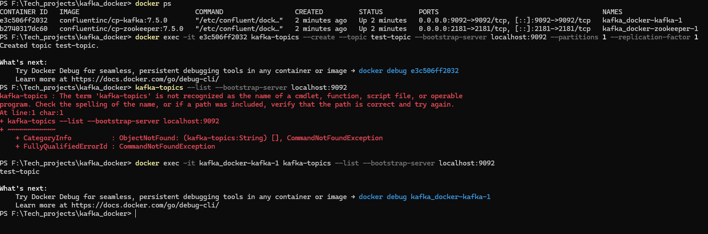

step1: https://www.docker.com/products/docker-desktop/ 
step2: create a docker compose file
step3: Go to that direcoory where the docker compose file exists 
step4: run the command "docker compose up -d"
step5: run the command "docker compose ps" to check if the containers are running
stepp6: create a topic using the command below
        docker exec -it <In windos use kafakname > kafka-topics --create --topic test-topic --bootstrap-server localhost:9092 --partitions 1 --replication-factor 1
step7: list the topics using the command below
        docker exec -it <In windos use kafakname > kafka-topics --list --bootstrap
"docker compose down -v" will erase all the data in the containers and start with a fresh instance of kafka and zookeeper.
docker compose down will stop the containers but will not erase the data. So when you start the containers again using "docker compose up -d", it will start with the existing data.

